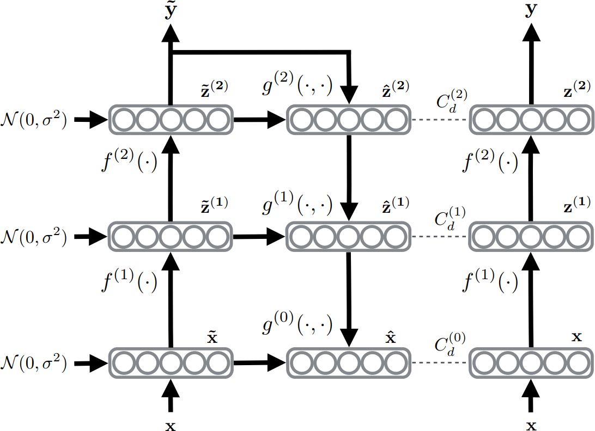

# Macro NN architecture

~~~
\subtitle{Machine Learning and Data Mining}
\author{Maxim Borisyak}

\institute{National Research University Higher School of Economics (HSE)}
\usepackage{amsmath}

\DeclareMathOperator*{\E}{\mathbb{E}}

\DeclareMathOperator*{\var}{\mathbb{D}}
\newcommand\D[1]{\var\left[ #1 \right]}

\DeclareMathOperator*{\argmin}{\mathrm{arg\,min}}
\DeclareMathOperator*{\argmax}{\mathrm{arg\,max}}
~~~

## Outline

### Super inspirational quotes

~~~quote
\Large Network architecture is more like an art.
~~~

`\vfill`

~~~quote
Behind every is a poorly formulated science.
~~~

### Network architecture

> Neural Network Architecture plays crucial role in Deep Learning.

`\vspace{5mm}`

Most of the non-trivial architectures:
- derived from common sense;
- explained by math;
- demonstrated on some real problems.

### Usual disclaimer

> The following examples are not aimed to be cover major architecture tricks.
> Just some examples happened to be known by the author.

## Pretraining

### Layerwise pretraining

### Pretraining

- layer-wise pretraining:
  - RBM;
  - AE;

- pretraining on simpler but related task.

## Auxilary losses

### Auxilary problems

$$\mathcal{L} = \mathcal{L}_{\mathrm{main}} + \lambda_1 \mathcal{L}_1 + \lambda_2 \mathcal{L}_2 + \dots$$

- solving several objectives with one network:
  - brining more information about the solution;
- auxilary losses should share the same solution;

***

### Auxilary problems: examples

Are the following auxilary problems reasonable:
- even vs. odd digit for MNIST;
- reconstructing initial image for MNIST;
- producing countour of target objects for detection problems;
- predicting type of a street-sign for detection problem;
- predicting super-class for CIFAR-100;
- predicting faces properies (e.g. smile/anger/neutral, female/male etc) for dimensionality reduction?

### Reconstruction regularisation

***

### Reconstruction regularization

### Reconstruction regularization

- unsupervised loss may be in conflict with classification loss;
  - reconstruction generally require higher network capacities;
  - discriminative features might be lost as unimportant for reconstruction;
- rarely used in practice.

### Deeply supervised networks

- try to solve original problem early;
- improved gradient flow (almost impossible to make it vanish);
- quite strong regularization effect;
- no unsupervised vs. supervised conflict.

***

### Ladder Networks

- replaces reconstruction with denoising:
  $$\mathcal{L} = \| f(x + \varepsilon) - x\|^2 \to \min, \, \varepsilon \sim \mathcal{N}(0, \sigma^2)$$

---

## Network structure

### Tree-like networks

### VGG

### Inception

---

- blue blocks: conv;
- red blocks: pool;
- green blocks: concat;
- yellow blocks: softmax.

### Inception block

### NIN: conv on steriods

### ResNet

### ResNet

`\vspace{3mm}`

### ResNet

### Highway networks

`\vspace{3mm}`

Feed-forward networks:

~~~equation*
  y = H(x, W_H)
~~~

Residual connection:

~~~equation*
  y = H(x, W_H) + x
~~~

Highway connection:

~~~equation*
  y = T(x, W_T) H(x, W_H) + C(x, W_C) x;
~~~

- $x, y$ - input, output;
- $H(x, W_H)$ - some transformation, e.g. convolution;
- $T(x, W_T), C(x, W_C) \in [0, 1]$ - gates (*transform* and *carry*).

### Highway networks

`\vspace{5mm}`

### Squeeze net

### Squeeze net

`\vspace{3mm}`

### U-net

### Exercise

Suggest an architecture for a face recognition security system:
- system should be able to grant access to any person with sufficient rights.

Describe:
- data required;
- function of the neural network (classification, regression, clusterisation);
- architecture of the network;
- training procedure.

## Summary

### Summary

- network architecture plays crucial role in Deep Learning;
- additional problems may provide additional information about solution;
- there are tons of various network architectures.

### References I

- Ronneberger O, Fischer P, Brox T. U-net: Convolutional networks for biomedical image segmentation. InInternational Conference on Medical Image Computing and Computer-Assisted Intervention 2015 Oct 5 (pp. 234-241). Springer, Cham.
- Szegedy C, Ioffe S, Vanhoucke V, Alemi AA. Inception-v4, Inception-ResNet and the Impact of Residual Connections on Learning. InAAAI 2017 (pp. 4278-4284).
- Srivastava RK, Greff K, Schmidhuber J. Highway networks. arXiv preprint arXiv:1505.00387. 2015 May 3.

### References II

- Rasmus A, Berglund M, Honkala M, Valpola H, Raiko T. Semi-supervised learning with ladder networks. InAdvances in Neural Information Processing Systems 2015 (pp. 3546-3554).
- Lee CY, Xie S, Gallagher P, Zhang Z, Tu Z. Deeply-supervised nets. InArtificial Intelligence and Statistics 2015 Feb 21 (pp. 562-570).
- Goodfellow IJ, Warde-Farley D, Mirza M, Courville A, Bengio Y. Maxout networks. arXiv preprint arXiv:1302.4389. 2013 Feb 18.
- Iandola FN, Han S, Moskewicz MW, Ashraf K, Dally WJ, Keutzer K. SqueezeNet: AlexNet-level accuracy with 50x fewer parameters and< 0.5 MB model size. arXiv preprint arXiv:1602.07360. 2016 Feb 24.

### References III

- Simonyan K, Zisserman A. Very deep convolutional networks for large-scale image recognition. arXiv preprint arXiv:1409.1556. 2014 Sep 4.
- He K, Zhang X, Ren S, Sun J. Deep residual learning for image recognition. InProceedings of the IEEE conference on computer vision and pattern recognition 2016 (pp. 770-778).
- Lin M, Chen Q, Yan S. Network in network. arXiv preprint arXiv:1312.4400. 2013 Dec 16.
