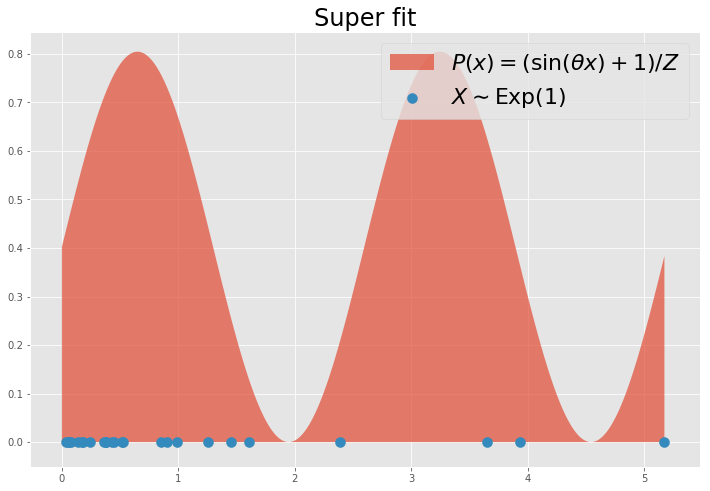
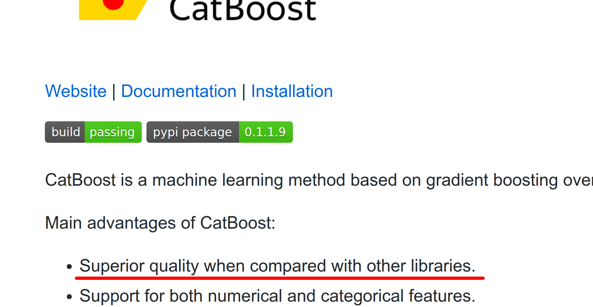

# No Free Lunch

~~~
\subtitle{Machine Learning and Data Mining}
\author{Maxim Borisyak}

\institute{National Research University Higher School of Economics (HSE)}
\usepackage{amsmath}
~~~

## No free lunch

### IQ test: try to learn yourself!

First question from [MENSA](https://www.mensa.org/workout/questions) website:`\\`
*Following the pattern shown in the number sequence below, what is the missing number?*

$$1, 8, 27, ?, 125, 216$$

Possible answers:
- 36
- 45
- 46
- 64
- 99

### IQ test: try to learn yourself!

First question from [MENSA](https://www.mensa.org/workout/questions) website:`\\`
*Following the pattern shown in the number sequence below, what is the missing number?*

~~~center
\begin{tabular}{c | c c c c c}
$X_{\mathrm{train}}$ & 1 & 2 & 3 & 5 & 6\\
\hline
$y_{\mathrm{train}}$ & 1 & 8 & 27 & 125 & 216
\end{tabular}
~~~

`\vspace*{5mm}`

$$X_\mathrm{test} = (4, )$$

### IQ test: try to learn yourself!

My solution:
$$y = \frac{1}{12}(91 x^5 - 1519 x^4 + 9449 x^3 - 26705 x^2 + 33588 x - 14940)$$

- fits perfectly!

My answer:
- 99

### IQ test

Why solution:
$$y = x^3$$
seems much more suitable than
$$y = \frac{1}{12}(91 x^5 - 1519 x^4 + 9449 x^3 - 26705 x^2 + 33588 x - 14940)?$$

### Terminology

Machine Learning is about learning algorithms $A$ that:
  - defined on sample set $\mathcal{X}$ (e.g. $\mathbb{R}^n$) and targets $\mathcal{Y}$ (e.g. $\{0, 1\}$);
  - take a problem (dataset) $D = (X, y) \subseteq \mathcal{X} \times \mathcal{Y}$;
  - learn relation between $\mathcal{X}$ and $\mathcal{Y}$;
  - and return prediction function:

~~~eqnarray*
  A(D) &=& f\\
  f: \mathcal{X} &\to& \mathcal{Y}
~~~

By this definition, e.g. XGBoost is a **family** of algorithms.

### No free lunch theorem

No free lunch theorem states that **on average by all datasets**
all learning algorithms are equally bad at learning.`\\`

Examples:
- crazy algorithm:
$$f(x) = \left\lfloor \left( \left\lceil \sum_i x_i + \theta \right\rceil \mod 17 + 1027 \right)^\pi \right\rfloor \mod 2$$
- any configuration of SVM

perform equally well **on average**.

### No free lunch theorem, stat. edition [plain]

### No free lunch, strictly

- binary classification with ground-truth: $y = F(x)$ and accuracy metric:
  $$L(A, x, y) = \frac{1}{|y|}\sum_i \mathbb{I}[A(x_i) = y_i]$$
- a learning algorithm $\mathcal{A}$ - set of predict functions (hypotheses);
- dataset $\mathcal{D}$ with $n = |D|$ and learning procedure $P_k(A \mid D)$
  - $A \in \mathcal{A}$
- error for learning procedure $k$:
  $$E_k(F, n) = \sum_{x \notin D} P(X) L(A, x, y) P_k(A \mid D)$$

### No free lunch, strictly

1. Uniformly averanged over all target functions:
  $$E_1(F, n) - E_2(F, n) = 0$$
2. For any fixed training dataset, uniformly averanged over F:
  $$E_1(F, n) - E_2(F, n) = 0$$

### No free lunch theorem

~~~figure
\centering
\includegraphics[width=0.8\textwidth]{imgs/no-free-lunch.png}
~~~

Possible learning algorithm behaviours in \textbf{problem space}:
- \textbf{+} - better than the average;
- {\color{red} \textbf{\textemdash}} - worse than the average.

### Is Machine Learning useless?

~~~center
\phantom{\Huge No.}
~~~

### Is Machine Learning useless?

~~~center
\textbf{\Huge No.}
~~~

## Assumptions and algorithms

### Is Machine Learning useless?

No Free Lunch theorem applies to:
- one learning algorithm;
- against all possible problems.

`\vspace*{5mm}`

In real world we have:
- **data scientist** with prior knowledge of the world;
- problem description;
- data description;
- a set of standard algorithms.

### Is Machine Learning useless?

Real world problems often behave nicely:
- data is collected by humans (features are determined by humans);
  - algorithms with human-bias dominate (e.g. XGboost);
- problems are posed by humans;
- a lot of assumptions behind the data can be quickly identified from the problem domain.

### Traditional ML (simplified)

- analyse the problem and make assumptions;
- pick an algorithm from a toolkit (e.g. logistic regression);
- provide assumptions suitable for the algorithm (**feature engineering**).

### Discussion

- this approach works well for traditional datasets with a small number of features:
- e.g. Titanic dataset:`\\`
~~~center
\begin{tabular}{|c | c | c | c | c | c|}
  \hline
  passenger class & name & gender & age & fare & \dots\\
  \hline
\end{tabular}
~~~

Essentially, performance of the algorithm depends on:
- knowledge of the domain;
- feature engineering skills;
- understanding of assumptions behind standard algorithms.

### Discussion

What are the assumptions behind:
- logistic regression,
- decision trees,
- linear SVM,
- SVM with RBF kernel?

### Representation matters

~~~tabular { c c c | c }
$x_1$ & $x_2$ & $x_3$ & $y$ \\
\hline
0 & 0 & 0 & 0\\
\hline
0 & 0 & 1 & 0\\
\hline
0 & 1 & 0 & 1\\
\hline
0 & 1 & 1 & 0\\
\hline
1 & 0 & 0 & 0\\
\hline
1 & 0 & 1 & 1\\
\hline
1 & 1 & 0 & 0\\
\hline
1 & 1 & 1 & 0\\
~~~

***

~~~phantom
a
~~~

### Representation matters

~~~center
\begin{tabular}{ c c c | c }
$x_1$ & $x_2$ & $x_3$ & $y$ \\
\hline
0 & 0 & 0 & 0\\
\hline
0 & 0 & 1 & 0\\
\hline
0 & 1 & 0 & 1\\
\hline
0 & 1 & 1 & 0\\
\hline
1 & 0 & 0 & 0\\
\hline
1 & 0 & 1 & 1\\
\hline
1 & 1 & 0 & 0\\
\hline
1 & 1 & 1 & 0
\end{tabular}
~~~

$$x = 4\cdot x_1 + 2\cdot x_2 + x_3 $$

***

~~~center
\begin{tabular}{ c | c }
$x$ & $y$ \\
\hline
0 & 0\\
\hline
1 & 0\\
\hline
2 & 1\\
\hline
3 & 0\\
\hline
4 & 0\\
\hline
5 & 1\\
\hline
6 & 0\\
\hline
7 & 0
\end{tabular}
~~~

$$y = \begin{cases} 1,& x \mod 3 = 2;\\ 0, &\text{otherwise} \end{cases}$$

### Representation matters

Solve with a descent algorithm:
$$(x - 8) ^2 \to \min$$
where: $x \in \{0, 1, \dots, 15\}$

- $\mathrm{neighbors}(x) = x \pm 1$;
- $\mathrm{neighbors}(x) = \left\{ z \mid  \|\mathrm{binary}(x) - \mathrm{binary}(z)\|_1 = 1 \right\}$

## Algorithms

### Quiz

~~~center
\textbf{ \huge What makes a good family of learning algorithms (ML library)?}
~~~

### Corollary from No-Free-Lunch

`\vspace*{5mm}`

A good machine learning family of algorithms/framework:
- has clear relation between hyperparameters and set of problems each algorithm covers;
- i.e. a data scientist can easily map their prior knowledge on hyperparameters.

`\vspace{5mm}`

A great machine learning family/frameworks:
- covers a wide range of problems;
- but each algorithm covers a small set of problems;
- i.e. a lot of sensitive and well-defined hyperparameters.

`\vspace{5mm}`

*Here feature engineering/selection/generation is a part of the algorithm.*

### I just leave it here

## Summary

### Summary

No-Free-Lunch:
- learning is impossible without prior knowledge;
- there is no silver bullet for learning;
- every learning algorithm has assumptions behind it;
- **data scientist's** job is to select/make an algorithm to match the assumptions.

### References

No-Free-Lunch theorem:
- Schaffer, Cullen. "A conservation law for generalization performance." Proceedings of the 11th international conference on machine learning. 1994.
- Wolpert, David H. "The supervised learning no-free-lunch theorems." Soft computing and industry. Springer London, 2002. 25-42.
- Wolpert, David H., and William G. Macready. "No free lunch theorems for optimization." IEEE transactions on evolutionary computation 1.1 (1997): 67-82.
