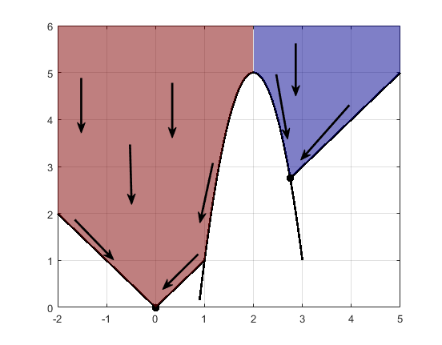

# Machine Learning and Data Mining

~~~
\subtitle{Optimization in ML}
\author{Maxim Borisyak}

\institute{National Research University Higher School of Economics (HSE)}
\usepackage{amsmath}

\DeclareMathOperator*{\argmin}{\mathrm{arg\,min}}
\DeclareMathOperator*{\argmax}{\mathrm{arg\,max}}
~~~

## Machine Learning in a nutshell

### ML algorithms

Every (supervised) ML algorithm ever:
- a model $\mathcal{A}$ - set of all possible solutions:
  $$\mathcal{A} \subseteq \{ f: \mathcal{X} \to \mathcal{Y} \}$$
    - $\mathcal{X}$, $\mathcal{Y}$ - sample and target spaces.
- a search procedure:
  $$S: \left(\mathcal{X} \times \mathcal{Y}\right)^n \to \mathcal{A}$$

### ML algorithms

`\vspace*{3mm}`
Decision Trees:
- model: piece-wise constant functions;
- search procedure: very sinful one.
`\vspace*{3mm}`

SVM:
- linear functions (in some space);
- search procedure: margin maximization.

`\vspace*{3mm}`
Logistic regression:
- linear functions;
- search procedure: $\mathrm{cross\text{-}entropy} \to \min$, any optimization method.
`\vspace*{3mm}`

In Deep Learning models are often decoupled from search procedures.

### ML algorithms
`\vspace*{3mm}`
Often, model-search can be factorized further:
- parametrized model:
  $$\mathcal{A} = \{ f_\theta : \mathcal{X} \to \mathcal{Y} \mid \theta \in \Theta \subseteq \mathbb{R}^n \}$$
- optimization problem:
  $$L(f_\theta, D) = \mathcal{L}(\theta) \to_\theta \min$$
  - $D \in (\mathcal{X} \times \mathcal{Y})^N$ - training set;
- optimization method $O$:
$$\theta^{t + 1} = O\left[ \theta^t, \mathcal{L} \right].$$

### ML algorithms

- parametrized model:
  - heavily domain/data dependent;
- optimization problem:
  - more or less universal:

~~~equation*
\mathcal{L} =
  \{ \text{log}, \text{hinge}, \dots \}\text{-loss} +
    \{ l_1, l_2 \}\text{-regularization};
~~~

- optimization method $O$:
  - heavily-dependent on nature of $\mathcal{L}$.

## Gradient methods

### The zoo
  - SGD, SGD with momentum:
    - you have no memory;
    - you have to write optimizer in 1 minute;
  - Nesterov momentum:
    - you want to fine-tune your solution.
  - RMSprop:
    - you have little memory and you gradients explode/vanish;
    - you have 2 minutes before submitting your code for training;
  - adagrad, adadelta, adam, adamax:
    - methods to go.

*Details are likely to be considered in Deep Learning course.*

## Second-order methods

### Flow chart

Do you have a nearly-quadratic target function?
`\vspace*{5mm}`
  - __yes__: is the problem low-dimensional?
    `\vspace*{3mm}`
    - __yes__: go Netwon!
    `\vspace*{3mm}`
    - __no__: use gradient or quasi-Newton methods;
  `\vspace*{5mm}`
  - __no__: use gradient or quasi-Newton methods.

## Hyper-parameter optimization

### Hyper-parameter optimization

Hyper-parameter optimization is a meta-algorithm that operates on union of models parametrized by $\psi$:
  $$\mathcal{A} = \bigcup_\psi \mathcal{A}_\psi = \{ f^\psi_{\theta_\psi} \mid \theta_\psi \in \Theta_\psi \}$$

- outer loss **might differ** from inner loss:
  $$\psi^* = \argmax_\psi Q \left( \argmin_{\theta_\psi} L(\theta_\psi) \right) $$
  - no sacred meaning, just for convinience:
  - example: $L$ - cross-entropy, $Q$ - ROC AUC.

### Hyper-parameter optimization

Outer optimization is usually evaluated on a separate set:
- via train-validation-test split;
- via cross-validation;
- the main reason for split into outer and inner problems.

`\vspace*{5mm}`

Alternatevely, BIC or similar can be used.

`\\[5mm]`

Outer optimization problem is usually non-differentiable:
- number of units, maximal depth of trees.

### Grid-search

Usually, ML algorithms are designed to have **a few**, **non-sensitive** hyper-parameters:
- outer problem is mostly convex and changes slowly;
- grid-search often works perfectly fine.

`\vspace*{5mm}`

Modifications, alternatives:
- randomized grid-search;
- random walk.

## Gradient-free methods

### Gradient-free methods

- local optimization:
  - 'traditional' methods;
- global optimization:
  - gradient and Hessian are fundamentally local properties;
  - evolutionary methods;
- black-box optimization:
  - variational optimization;
  - Bayesian optimization.

### Traditional gradient-free methods

- evaluation of objective function is cheap;
- in practice, **often** can be replaced by gradient-methods:

~~~equation*
\text{cheap} \Rightarrow
  \begin{bmatrix}
    \text{closed-form expression}\\
    \text{or}\\
    \text{allow approximation}
  \end{bmatrix}
  \Rightarrow \text{differentiable}.
~~~

- example: Powell, Nelder-Mead.

### Multi-start

> Just launch local procedure multiple times with different initial guesses.

---

- each local optima acts like an attractor for local methods;
- effective if depth of local optima positively depend on area of attraction.

***



### Evolution methods

> There are just so many...

Basic operations:
- mutation: $x' = x + \mathrm{noise}$;
- crossover: $x' = \mathrm{crossover}(x_1, x_2)$;

`\vspace*{5mm}`

Application:
- you have no idea how to optimize objective.

### Memetic algorithms

`\vspace*{5mm}`

```python
def memetic(global_step=evolutionary,
            locally_optimize=annealing):

  population = []
  mature_population = [ <random> ]

  while ...:
    population = global_step(mature_population)
    mature_population = [
      locally_optimize(x) for x in population
    ]
  return mature_population

multistart = lambda locally_optimize:  memetic(
  random_sampling, locally_optimize
)
```

### Black-box optimization

- heavy objective;
- non-differentiable:
  - complex computer simulations (e.g. aero-dynamics);
- so multi-modal, gradient does not have sense:
  - extremely deep networks (e.g. reccurent networks);
